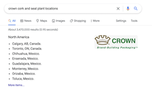
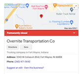

# United States of Solidarity
Mapping labor movements through events, landmarks, leaders, strikes, organizations, and collective tech actions in the United States. It was largely inspired by the NYT's repeated surprise that labor movements come out of the south:
* ["Amazon Union Drive Takes Hold in Unlikely Place," New York Times, January 25, 2021](https://www.nytimes.com/2021/01/25/business/amazon-union-alabama.html)

  
## Events & Leaders
https://aflcio.org/about-us/history
https://aflcio.org/about/history/labor-history-people
 
Key events and leadership from the American Federation of Labor and Congress of Industrial Organizations (AFL-CIO), the largest federation of unions in the United States.

  
## Events & Organizations
https://depts.washington.edu/iww/yearbook_intro.shtml
https://depts.washington.edu/iww/locals.shtml
 
Events and local chapters from the IWWW (International Workers of the World) from 1905-1935.

  
## Landmarks
https://www.laborheritage.org/inventory-of-american-labor-landmarks/
 
Labor Landmarks archived by the Labor Heritage Foundation, a non-profit organization which preserves and disseminates information and artifacts about the labor history of the United States 1

  
## Strikes
https://www.bls.gov/web/wkstp/monthly-listing.htm
 
Work stoppages involving 1,000 or more workers, 1993-Present from the U.S. Bureau of Labor Statistics.

  
## Tech Collective Action
https://collectiveaction.tech/
 
US-based collective actions from workers in the tech industry from Collective Actions in Tech.

  
## Other sources
### Noun project con starter files
* [Star by AliWijaya from the Noun Project](https://thenounproject.com)
* [memorial by RomStu from the Noun Project](https://thenounproject.com)
* [speech-bubble by Alex Fuller from the Noun Project](https://thenounproject.com)
* [Fist by matias porta lezcano from the Noun Project](https://thenounproject.com)
* [Warning by Dillon Arloff from the Noun Project](https://thenounproject.com)
* [Power by Yoteyo from the Noun Project](https://thenounproject.com/search/?q=power&i=1711145)

### Resources
* [U.S. City & State Data from Pareto Software, LLC.](https://simplemaps.com/data/us-cities)
* [Center for Union Facts](https://www.unionfacts.com/cuf/)
* [Tech Workers Coalition](https://techworkerscoalition.org/)

  
|  |  |  |
